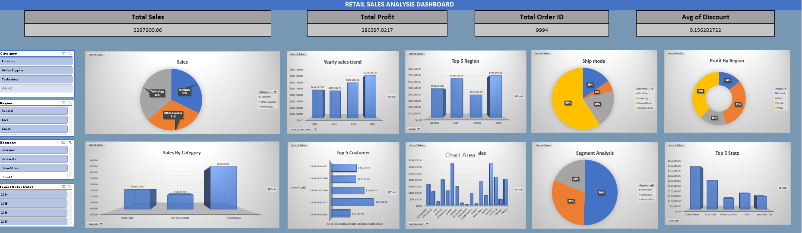

# Retail Sales Analysis Project using Excel

## Project Overview

This project focuses on analyzing retail sales performance using the Superstore dataset in Microsoft Excel. The main objective is to identify business insights related to sales, profit, customer behavior, product performance, and regional trends through data cleaning, pivot table analysis, dashboard creation, and business storytelling.

The project demonstrates practical Excel skills used in real-world business analysis environments.

---

# Project Objectives

- Analyze overall sales and profit performance
- Identify high-performing regions and product categories
- Track monthly sales trends
- Understand discount impact on profitability
- Build an interactive business dashboard
- Present insights for data-driven decision making

---

# Tools & Features Used

## Microsoft Excel Features

- Data Cleaning
- Excel Tables
- Pivot Tables
- Pivot Charts
- KPI Cards
- Conditional Formatting
- Slicers & Filters
- Dashboard Design
- Business Insights Reporting

---

# Project Structure

## 1. Raw Dataset

Original Superstore retail sales dataset.

## 2. Cleaned Data

- Removed inconsistencies
- Checked missing values
- Standardized formatting
- Structured data into Excel table format

## 3. Pivot Tables

Created pivot tables to analyze:

- Sales by Category
- Profit by Region
- Monthly Sales Trends
- Order Count Analysis
- Average Discount Analysis

## 4. Business Analysis Dashboard

Interactive dashboard containing:

- Total Sales KPI
- Total Profit KPI
- Total Orders KPI
- Sales Trend Charts
- Region-wise Analysis
- Category Performance
- Profitability Insights
- Business Recommendations

## 5. Project Overview Sheet

Provides complete project summary including:

- Business Objective
- Dataset Description
- Data Cleaning Process
- Key Insights
- Final Conclusion

---

# Key Business Insights

- West Region generated the highest sales and profit.
- Technology category contributed the highest revenue.
- Discounts impacted profitability in some product segments.
- Seasonal sales trends showed strong monthly variation.
- Some regions performed well in sales but lower in profit.

---

# Business Recommendations

- Increase focus on high-performing regions.
- Reduce excessive discounting on low-profit products.
- Improve marketing for underperforming categories.
- Use monthly trend analysis for inventory planning.
- Monitor profit margins along with sales growth.

---

# Dashboard Preview

## Main Dashboard

> Upload your dashboard screenshot into the GitHub repository and rename it as `dashboard.png`

---

# Skills Demonstrated

- Business Analysis
- Data Cleaning
- Data Visualization
- Dashboard Design
- KPI Reporting
- Analytical Thinking
- Insight Generation

---

# Business Use Case

This project simulates a real-world retail business scenario where management needs data-driven insights to improve sales performance, profitability, and operational decisions.

---

# Future Improvements

- Add Power Query automation
- Add forecasting analysis
- Build Power BI dashboard version
- Connect live datasets

---

# Author

**Shyam**
